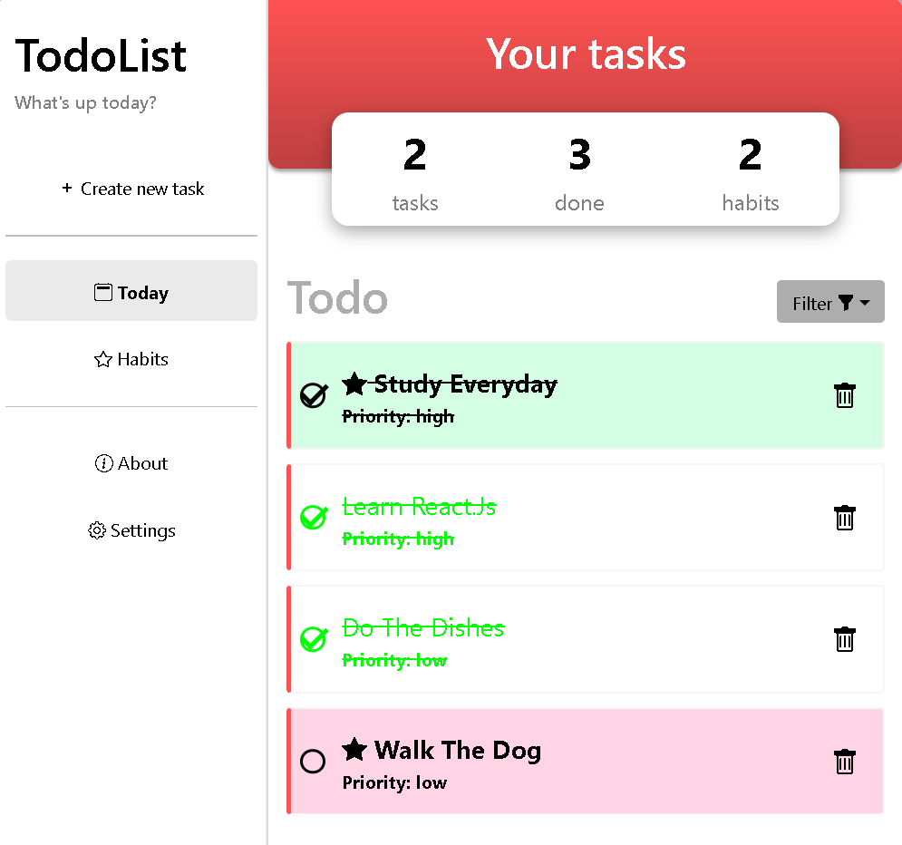
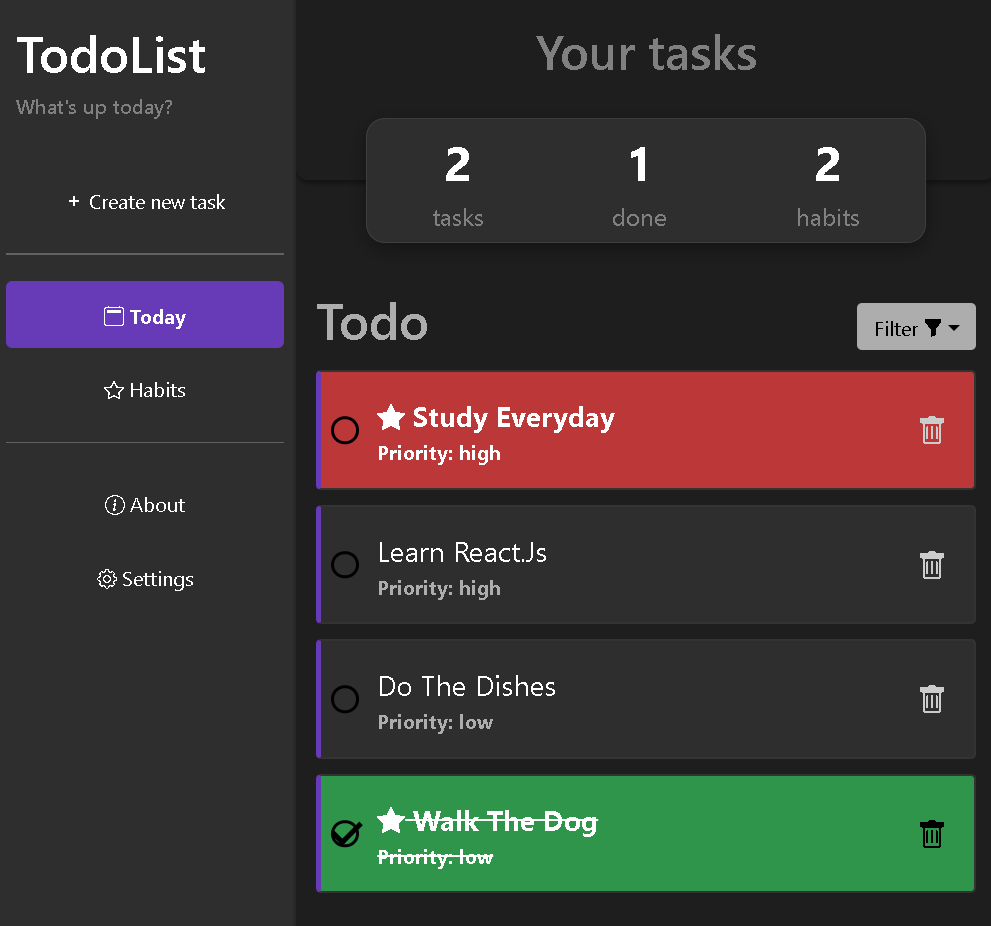
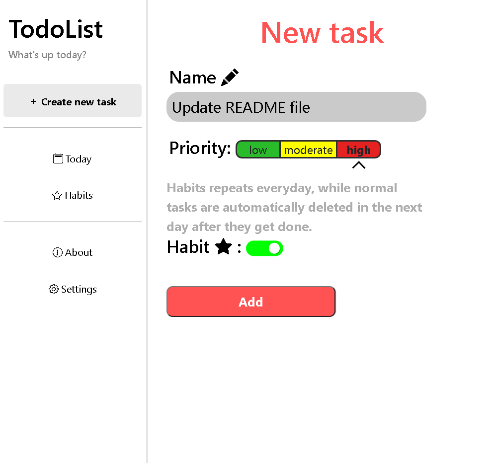
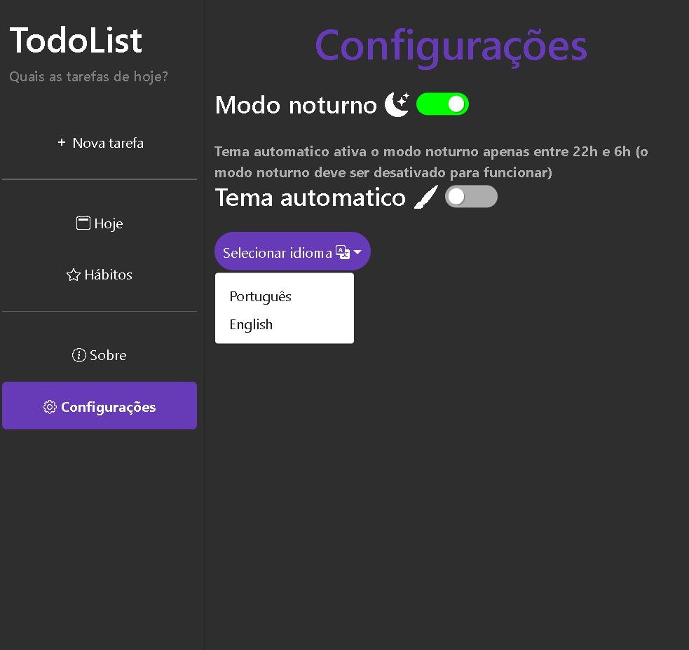

<h1 align="center">
    
</h1>
<h1 align="center">
    
</h1>
<h1 align="center">
    
</h1>
<h1 align="center">
    
</h1>

# React Todolist

<a align="center" style="font-weight: bold" href="https://alcantara-diego.github.io/todolist/" target="_Blank">👉Acesse meu projeto nesse link👈</a>

  

<h3>Tecnologias usadas no projeto</h3>
<ul>
<li>HTML5</li>
<li>CSS3</li>
<li>Javascript</li>
<li>React.js</li>
<li>Bootstrap</li>
</ul>

  
# Descrição

Aplicativo de gerenciamento de tarefas, meu primeiro projeto feito usando <strong>REACT</strong>. 

# Aprendizados com o projeto:

<strong>Separar componentes: </strong> Aprendi a trabalhar separando os componentes do projeto, assim o tornando mais organizado e mais fácil de dar manutenção em futuras atualizações. 

<strong>Uso de hooks: </strong>Aprendi a usar hooks como <strong>UseEffect</strong> e <strong>UseState</strong>

<strong>Terminal e Pacotes NPM: </strong> Neste projeto usei o terminal pela primeira vez e aprendi a navegar entre pastas com o comando <strong>CD</strong>, instalei o React com o comando <strong>npx create-react-app (nome do projeto)</strong>, trabalhei nele com o <strong>npm start</strong> e <strong>npm run build</strong>. Além de aprendender a alterar o <strong>package.json</strong> para dar deploy no projeto e o hospedar no <strong>Github Pages.</strong> 

  
# Features do projeto:
 
<strong>Memória salva:</strong> Tarefas e configurações salvas no localStorage do navegador.

<strong>Tarefas simples:</strong> São apagadas automaticamente no dia seguinte em que são completadas.

<strong>Hábitos:</strong> tarefas especiais que se repetem todos os dias e nunca são apagadas automaticamente.

<strong>Nível de prioridade nas tarefas:</strong>  (baixa, moderada ou alta) para serem melhor organizadas.

<strong>Alterar ordem das tarefas:</strong> Opção de ordenar as tarefas por ordem alfabética, nível de prioridade, hábitos primeiro ou tarefas simples primeiro.

<strong>Painel automático:</strong> Painel informando quantas tarefas e hábitos foram criados, e quantas delas foram completadas.

<strong>Idiomas: </strong>  Português e inglês como idiomas disponíveis nas configurações.

<strong>Modo noturno:</strong> Modo noturno presente nas configurações do app.

<strong>Tema automático:</strong> Modo noturno automaticamente ativado durante um certo período da noite e também desligado automaticamente a uma certa hora do dia.
 
   
 # Pré-requisitos:

 Nenhum pré-requisito necessário, apenas te convido a dar uma olhada :)

 
<a align="center" style="font-weight: bold" href="https://alcantara-diego.github.io/todolist/" target="_Blank">👉Acesse meu projeto nesse link👈</a>

  

<strong>|Made with ❤️ by Diego Alcântara 👨🏽‍💻 <a align="center" style="font-weight: bold" href="https://www.linkedin.com/in/diego-alc%C3%A2ntara-790424235" target="_Blank">See my linkedIn</a></strong>

